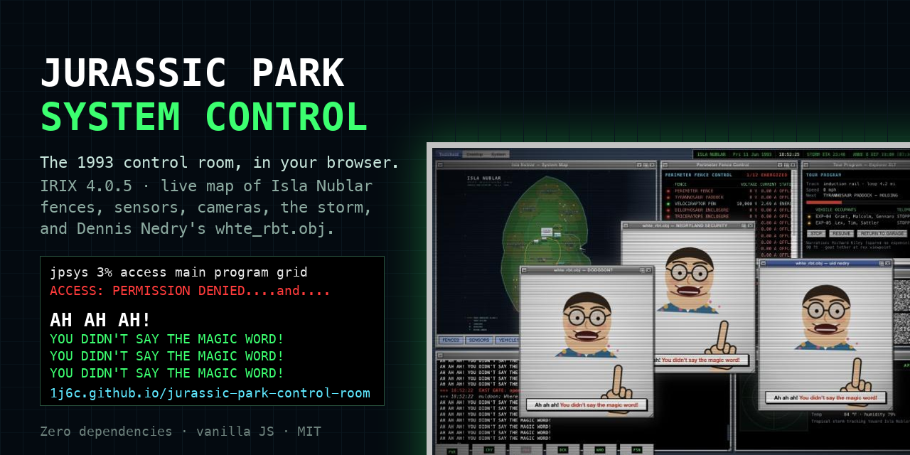

# Jurassic Park: System Control

You know the scene. Samuel L. Jackson types `access main program grid`, the screen says PERMISSION DENIED, and then a cartoon Dennis Nedry pops up wagging his finger. "Ah ah ah. You didn't say the magic word."

This is that computer. The whole thing. Not a gif of the animation, the actual control room of Isla Nublar on the evening of June 11, 1993, running in your browser: the SGI workstation, the map of the island, the fences, the sensors, the cameras, the storm coming in, the boat waiting at the east dock, and a fat guy in a Hawaiian shirt who is about to ruin everyone's night.

**Play it here, nothing to install: https://1j6c.github.io/jurassic-park-control-room/**



## What you get

The page boots like a real IRIX 4.0.5 machine (the actual version string, the real memory check, the "system is coming up, please wait"). Then you land on a 4Dwm desktop with windows you can drag, iconify and resize, a Toolchest menu in the corner, and a clock that runs on park time.

Around you:

- **The island.** A live SVG map of Isla Nublar with the eleven paddocks from the film's own map (Tyrannosaur, Velociraptor, Dilophosaur, Triceratops, Brachiosaur, Gallimimus, Herrerasaur, Metriacanthosaur, Baryonyx, Segisaur, Proceratosaur), electric fences pulsing at 10,000 volts, motion sensors that light up when an animal walks past, animals that actually walk past, and two Ford Explorers crawling along the tour rail at 15 mph.
- **Ten control panels.** Fence voltages and currents. The sensor network. The tour program. Four night-vision camera feeds. A weather radar with a tropical storm on it. Power distribution. The embryo cold storage with its fifteen vials. The phone system Nedry is "debugging". The east dock, with a countdown. Who's logged in.
- **A console.** A real csh prompt with sixty-odd commands, tab completion, history, and a file system you can wander through. Nedry's home directory is right there. So is his mail.
- **The sabotage.** It happens on the film's timeline whether you're ready or not.
- **The lockout.** The head, the finger, the voice, the wall of text scrolling in the terminal. Close the window and two more open. Type `please`. Go on.
- **Two ways out.** One is the way they did it in the movie. The other one Nedry typed in front of everybody.

Every sound is synthesized in the browser. The hum of the room, the rain, the thunder, the alarm, the T-Rex footsteps that shake the screen and ripple the cup of water in the corner. There isn't a single file taken from the film in this repository.

## Put yourself in the animation

Toolchest, then System, then **Nedry Setup**.

Give it a photo and your face becomes the wagging head, with the jaw moving to the sound of your own voice. Give it three seconds of microphone and your voice goes through a ring modulator, which is how they made Nedry sound like a robot in 1993. Set the phrase to French or English. Drop an image anywhere on the desktop, that works too.

Nothing leaves your computer. The photo and the recording live in your browser's local storage and nowhere else.

## How the evening goes

Park time runs three times faster than yours. `timescale 6` if you're in a hurry, `scenario skip` to jump straight to the next thing.

| Park time | What happens |
|-----------|--------------|
| 18:48 | You log in as Ray Arnold. The tour is out. The storm is 14 miles away. Nedry is at workstation 3 "finishing the phones". |
| 18:49 | Nedry goes to get a soda. Hammond calls the tour back because of the weather. |
| 18:51 | `whte_rbt.obj` runs. Cameras go to snow. Eleven fences drop, one after the other. Door locks release. Phones die. The cars stop right in front of the T-Rex paddock. The raptor pen stays live, because even Nedry knew better. |
| 18:52 | Jeep 12 leaves through the east gate. |
| 18:53 | Something big crosses the fence line in sector 4. Explorer 04 stops answering. Nedry misses the turn to the dock. |
| 18:55 | The cryo vault reports fifteen vials missing. |
| 19:00 | The Anne B leaves the east dock on time. Cargo: none. |

From the moment the grid locks, every system command gets you PERMISSION DENIED. The third one gets you Nedry.

### Getting the park back

**The film's way.** `shutdown`. Hammond says do it. Arnold says hold onto your butts. The screen goes black and you're in the maintenance shed with Ellie: charge the primer, throw the main, flip the breakers one at a time. The machine reboots. The raptors got out during the blackout, so now it's Lex's turn: open `fsn`, the 3D file system navigator (yes, the "It's a UNIX system!" one, drawn in canvas with a hand-rolled projection), find `/usr/jpsys/security/visitor_center/door_locks`, engage them. Then `fences reset`. Then breathe.

**Nedry's way.** He set up a back door and typed it right there in the control room with everyone watching. Try `keychecks`.

Either way you get an InGen incident report at the end, with the recovery time, the number of times you got denied, and a list of what the park lost. The lawyer is on it.

## The console

Type `help` for the real commands. A few worth knowing:

```
status              everything at a glance
access <system>     open a panel: "access main program grid", "access security"
fences reset        the thing you'll want at the end
who / ps / kill     see who's logged in and what they're running. try killing pid 4127.
keychecks           the keystroke audit log from workstation 3
ls / cd / cat       the file system. start with /usr/nedry. don't forget ls -a.
fsn                 the 3D navigator
timeline            the evening's schedule and what's already happened
shutdown            the nuclear option
```

There are about thirty hidden commands on top of that. The characters' names are a good start. So is the goat.

## Running it locally, full screen

The hosted version is the easy way. If you want it in kiosk mode on your own machine (no address bar, no tabs, just the control room):

```bash
git clone https://github.com/1j6c/jurassic-park-control-room.git
cd jurassic-park-control-room
./start.sh
```

On Windows, double-click `start.bat` instead.

The script starts a small local server and opens Chrome (or Chromium, Brave or Edge) in kiosk mode with its own profile, so it doesn't touch your usual browser. Quit the browser and the server stops with it. The only requirement is Python 3, which macOS already has and Windows can get from python.org in a minute.

No Python? It's static files. Any web server will do.

## What it needs from your browser

A desktop, a keyboard, and something recent. Chrome is the best experience because it has the good speech synthesis voices and the microphone recording is smooth. Firefox and Safari work. Phones get a polite message explaining that this is a control room, not a phone.

The park pauses when you switch to another tab. The clock runs on the browser's animation loop, and browsers stop that loop for hidden tabs. Think of it as the dinosaurs waiting for you.

## How it's built

No framework, no build step, no dependencies. One HTML file, one stylesheet, twelve scripts loaded with plain script tags. You can read the whole thing in an afternoon.

```
index.html        the page
css/irix.css      Motif look, window chrome, panels, the CRT overlay
js/core.js        event bus, park clock, the model of every system in the park
js/audio.js       every sound, synthesized: hum, rain, thunder, klaxon, footsteps, roar, the ring-mod voice
js/wm.js          the window manager
js/fs.js          the fake IRIX file system, Nedry's mail included
js/island.js      the map: paddocks, fences, sensors, animals, vehicles, the storm front
js/panels.js      the ten control panels
js/shell.js       the console and its commands
js/fsn.js         the 3D file system navigator
js/nedry.js       the head, the finger, the voice loop, the multiplying windows
js/scenario.js    the timeline, the sabotage, the shutdown, the shed, the recovery
js/boot.js        the boot sequence
js/main.js        wiring, Toolchest, clock bar, screen shake, the cup of water
```

If you want to add a command, an easter egg or a panel, see [CONTRIBUTING.md](CONTRIBUTING.md). Pull requests that make it more like the film are the ones that get merged.

## Why

Because that scene is thirty years old and still the best computer scene in any movie, and because the actual system behind it (the map, the fences, the tour program, the phones) is only ever glimpsed for a second or two. I wanted to sit at that desk. Now you can.

## Who made it

1j6c. Commits are signed, releases carry a Sigstore attestation and a Bitcoin timestamp, and there's a signed statement inside the code. It's all in [docs/AUTHORSHIP.md](docs/AUTHORSHIP.md), or type `verify` in the console. Also, `cat /usr/people/1j6c/README`.

## Legal

This is a fan project. It has nothing to do with Universal Pictures, Amblin Entertainment or the estate of Michael Crichton, and they haven't endorsed anything. No assets from the film are used: every image is drawn in SVG or canvas at runtime, every sound is generated in Web Audio. The code is under the MIT license, so do what you want with it, just keep the license file.

---

## En français

C'est l'ordinateur de la scène. Vous savez, celle où Samuel L. Jackson tape `access main program grid`, où l'écran répond PERMISSION DENIED, et où un Dennis Nedry en dessin animé arrive en agitant le doigt. "Ah ah ah, tu n'as pas dit le mot magique."

Pas un gif de l'animation. Toute la salle de contrôle d'Isla Nublar, le soir du 11 juin 1993, dans votre navigateur : la station SGI, la carte de l'île, les clôtures, les capteurs, les caméras, la tempête qui arrive, le bateau qui attend au dock, et un gros type en chemise hawaïenne qui va gâcher la soirée de tout le monde.

**Ça se joue ici, rien à installer : https://1j6c.github.io/jurassic-park-control-room/**

Ce qu'il y a dedans :

- Un boot IRIX 4.0.5 (la vraie version), puis un bureau 4Dwm avec des fenêtres qu'on déplace et qu'on iconifie.
- La carte vivante de l'île : les onze enclos du film, les clôtures à 10 000 volts, les capteurs qui s'allument quand un animal passe, les deux Explorer sur le rail.
- Dix panneaux de contrôle : clôtures, capteurs, visite, quatre caméras, radar météo, énergie, cryo, téléphones, dock, personnel.
- Une console csh avec une soixantaine de commandes et un vrai faux système de fichiers. Le dossier de Nedry est là. Ses mails aussi.
- Le sabotage, à l'heure du film. Puis le verrouillage : la tête, le doigt, la voix, le mur de texte. Fermer la fenêtre en ouvre deux. `please` ne marche pas, ça n'a jamais marché.
- Deux façons de sortir. Celle du film : `shutdown`, la cabane des disjoncteurs avec Ellie, le reboot, les raptors dehors, `fsn` pour verrouiller les portes comme Lex, puis `fences reset`. Et celle de Nedry, qu'il a tapée devant tout le monde. `keychecks`.

**Vous dans l'animation** : Toolchest, System, Nedry Setup. Une photo devient la tête (la mâchoire bouge sur votre voix), trois secondes de micro passent dans un modulateur en anneau, la voix de robot de 1993. Tout reste dans votre navigateur.

**En local, plein écran** : `./start.sh` sur macOS et Linux, `start.bat` sur Windows. Il faut juste Python 3.

Tout le son est synthétisé, toutes les images sont dessinées. Aucun fichier du film. Projet de fan, licence MIT.

Environ trente commandes cachées. Les noms des personnages sont un bon début. La chèvre aussi.
